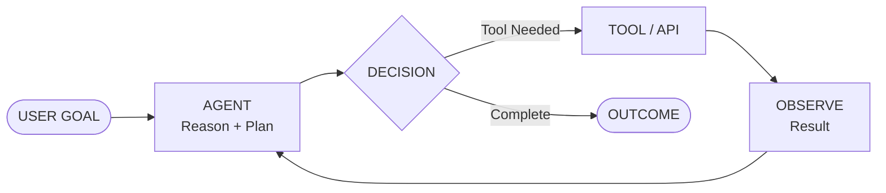
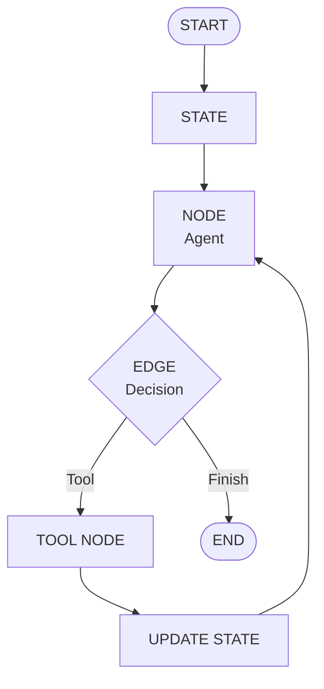
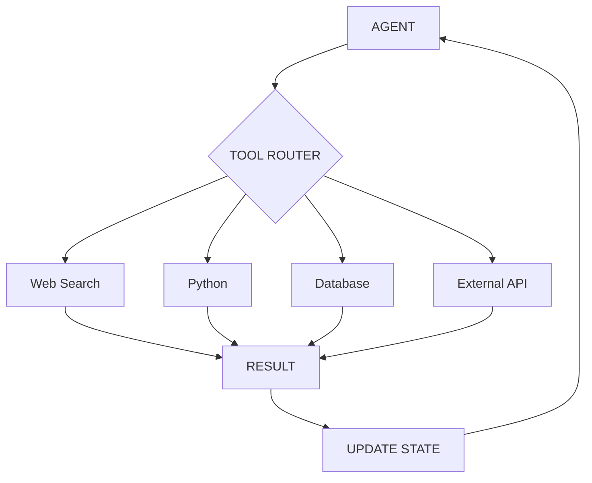
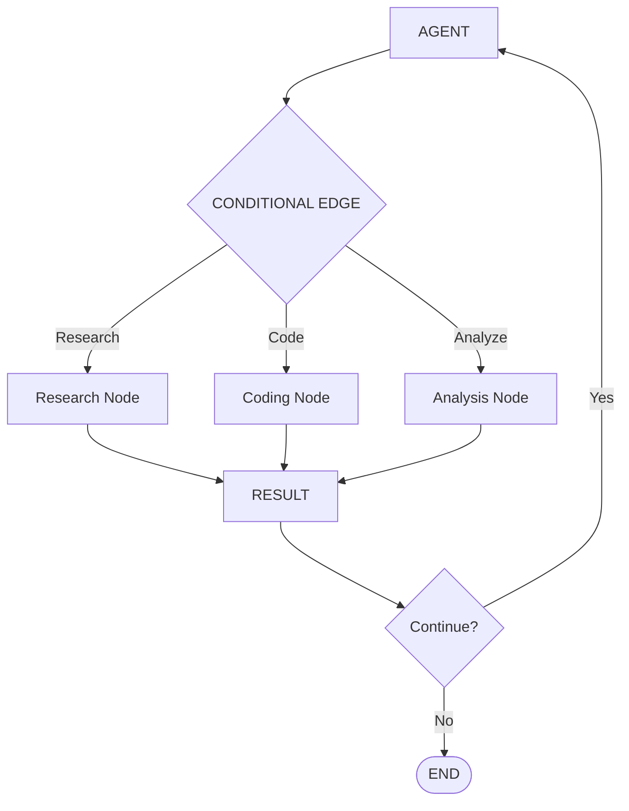
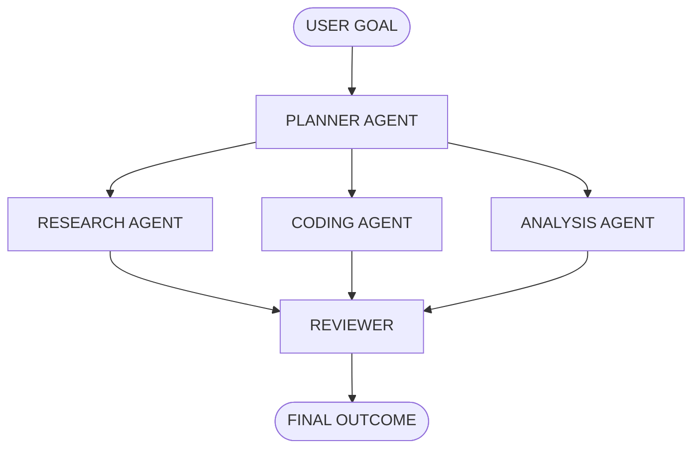
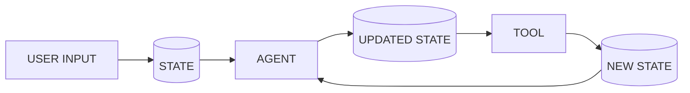
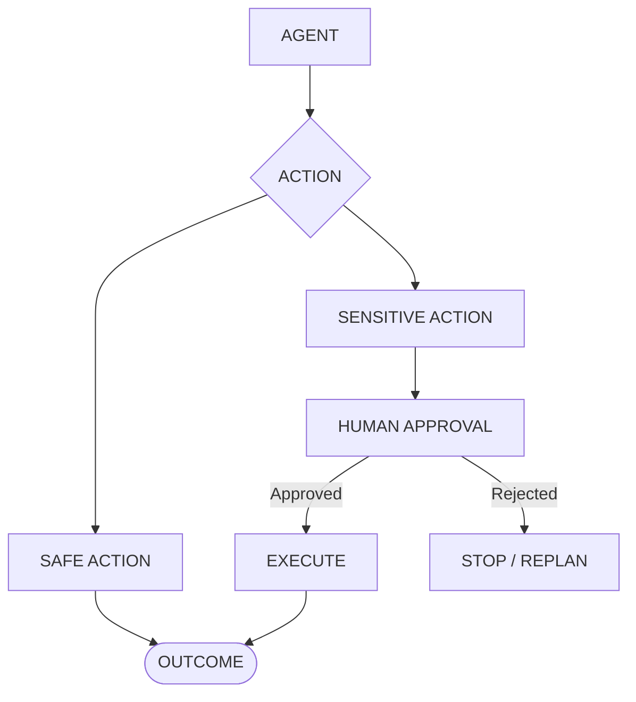
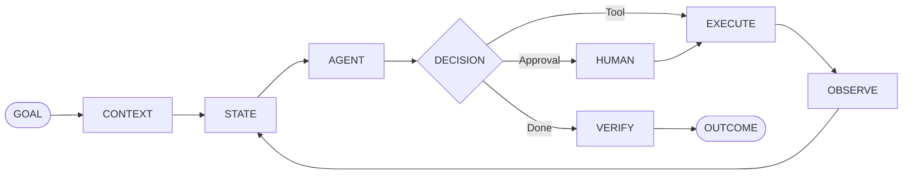

# 🤖 LangGraph Agents

### Agentic AI Workflows with LangGraph

**Reason → Act → Observe → Decide → Execute**

[](https://python.org)
[]
[]

---

## 🧠 Agentic AI

Agentic AI combines **reasoning, tools, memory, decisions, and actions** to complete multi-step tasks.



**Concepts:** `Goal → Reasoning → Decision → Tool → Observation → Loop → Outcome`

---

## ⚡ LangGraph Core

LangGraph models an agent as a **stateful graph**.



### Core Concepts

```text
STATE
  │
  │ stores context
  ▼
NODES
  │
  │ execute logic
  ▼
EDGES
  │
  │ control routing
  ▼
TOOLS
  │
  │ perform actions
  ▼
OBSERVATION
  │
  │ update state
  ▼
OUTCOME
```

**State → Nodes → Edges → Tools → Observation → Outcome**

---

## 🛠️ Tool Calling

Agents can dynamically select tools based on the current state.



**Concepts:** `Tool Calling • Routing • State Update • Feedback Loop`

---

## 🔀 Conditional Routing

LangGraph can route execution based on decisions.



**Concept:** `Node → Conditional Edge → Node`

---

## 🤝 Multi-Agent

Multiple specialized agents can work together inside one graph.



**Concepts:** `Planner • Specialized Agents • Coordination • Review`

---

## 🧠 State

State is the shared information flowing through the graph.



```text
STATE = Context + Messages + Results + Decisions
```

---

## 👤 Human-in-the-Loop

Sensitive actions can pause the graph for approval.



**Concept:** `Agent → Approval → Execute → Verify → Outcome`

---

## 🏗️ Complete Workflow



### The Agentic Loop

**Goal → Context → State → Reason → Decide → Act → Observe → Verify → Outcome**

---


---

## ⚙️ Setup

```bash
git clone https://github.com/YOUR_USERNAME/langgraph-agents.git

cd langgraph-agents

uv venv

uv pip install -r requirements.txt

python main.py
```

Create `.env`:

```env
OPENAI_API_KEY=your_api_key
```

---

## 🎯 Learning Flow

```text
LLM
 ↓
Prompting
 ↓
Tool Calling
 ↓
Agent
 ↓
State
 ↓
LangGraph
 ↓
Conditional Routing
 ↓
Memory
 ↓
Human-in-the-Loop
 ↓
Multi-Agent
 ↓
Production Workflow
```

---

## 🚀 Vision

```text
UNDERSTAND
     ↓
REASON
     ↓
PLAN
     ↓
ACT
     ↓
OBSERVE
     ↓
VERIFY
     ↓
OUTCOME
```

### 🤖 LangGraph × Agentic AI

**Build systems that don't just answer — they execute workflows.**
